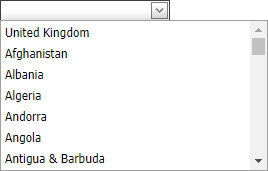

<!-- default badges list -->

[](https://supportcenter.devexpress.com/ticket/details/E1426)
[](https://docs.devexpress.com/GeneralInformation/403183)
[](#does-this-example-address-your-development-requirementsobjectives)
<!-- default badges end -->

# Combo Box for ASP.NET Web Forms - How to load items on a callback

This example shows how to load combo box items on the first click of the drop-down button.



In this example, the [ASPxComboBox](https://docs.devexpress.com/AspNet/DevExpress.Web.ASPxComboBox) control initially has one (default) item. 

```cs
private const string DefaultCountryName = "United Kingdom";

protected void Page_Load(object sender, EventArgs e) {
    if(!IsCallback) {
        cbCountries.Items.Add(DefaultCountryName);
        cbCountries.SelectedIndex = 0;
    }
}
```

When the drop-down button is clicked, the [DropDown](https://docs.devexpress.com/AspNet/js-ASPxClientDropDownEditBase.DropDown) event handler sends a callback to the server if the items are not loaded yet.

```js
function OnDropDown(s, e) {
    if(!s.countriesLoaded) {
        s.countriesLoaded = true;
        cbCountries.PerformCallback();
    }
}
```

The [PerformCallback](https://docs.devexpress.com/AspNet/js-ASPxClientComboBox.PerformCallback(parameter)) method invokes the server [Callback](https://docs.devexpress.com/AspNet/DevExpress.Web.ASPxAutoCompleteBoxBase.Callback) event. The event handler populates the [Items](https://docs.devexpress.com/AspNet/DevExpress.Web.ASPxAutoCompleteBoxBase.Items) collection with a list of items.

```cs
protected void OnCallback(object source, CallbackEventArgsBase e) {
    List<string> counties = new List<string>(DataProvider.GetCountries());
    counties.Remove(DefaultCountryName);
    ((ASPxComboBox)source).Items.AddRange(counties);
}
```

## Files to Review

* [Default.aspx](./CS/Default.aspx) (VB: [Default.aspx](./VB/Default.aspx))
* [Default.aspx.cs](./CS/Default.aspx.cs) (VB: [Default.aspx.vb](./VB/Default.aspx.vb))
* [Countries.xml](./CS/App_Data/Countries.xml) (VB: [Countries.xml](./VB/App_Data/Countries.xml))
* [DataProvider.cs](./CS/DataProvider.cs) (VB: [DataProvider.vb](./VB/DataProvider.vb))

## Documentation

* [On-Demand Item Load Mode](https://docs.devexpress.com/AspNet/8205/components/data-editors/aspxcombobox/concepts/item-loading-modes#on-demand)
<!-- feedback -->
## Does this example address your development requirements/objectives?

[](https://www.devexpress.com/support/examples/survey.xml?utm_source=github&utm_campaign=asp-net-web-forms-combobox-load-items-on-callback&~~~was_helpful=yes) [](https://www.devexpress.com/support/examples/survey.xml?utm_source=github&utm_campaign=asp-net-web-forms-combobox-load-items-on-callback&~~~was_helpful=no)

(you will be redirected to DevExpress.com to submit your response)
<!-- feedback end -->
